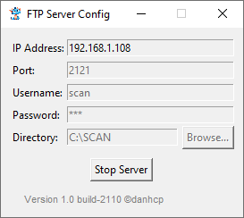

# mFTP Server

  

    <b>Giải pháp FTP Server tối giản & bảo mật cho Windows</b>

---

## 🧭 Giới thiệu

**mFTP Server** là ứng dụng máy chủ FTP được thiết kế đặc biệt cho môi trường văn phòng (nhận file từ máy Scan/Photocopy) hoặc chia sẻ dữ liệu nội bộ.

Phiên bản **2.0** là một bản nâng cấp toàn diện với giao diện cài đặt trực quan, cơ chế bảo mật mã hóa và khả năng vận hành ổn định mà không yêu cầu quyền Administrator liên tục.

## ✨ Tính năng nổi bật (v2.0)

- **🚀 Chạy ngầm thông minh:** Hoạt động dưới khay hệ thống (System Tray), tự động ẩn giao diện khi khởi động cùng Windows.
- **🔒 Bảo mật cao:** Mật khẩu và thông tin cấu hình được **mã hóa hệ thống** (DPAPI), an toàn hơn so với lưu văn bản thuần.
- **🛡️ Tự động hóa:** Trình cài đặt tự động mở Port Firewall (mặc định 2121) và thiết lập quyền truy cập thư mục.
- **👤 User-Friendly:** Chỉ cần quyền Admin khi cài đặt. Sau đó, ứng dụng chạy trơn tru trên tài khoản User thường.
- **📦 Trình cài đặt GUI:** Giao diện cài đặt và gỡ bỏ trực quan, báo trạng thái rõ ràng.

---

## 💾 Hướng dẫn Cài đặt

1. **Tải xuống:**  
   👉 [Tải mFTP Setup.exe](https://github.com/caophuocdanh/mFTP-Server/releases/download/v2.0/mFTP.Setup.exe)

2. **Cài đặt:**  
   - Chạy tệp `mFTP Setup.exe` (Yêu cầu quyền Administrator).
   - Nhấn nút **Cài đặt**.
   - Phần mềm sẽ tự động:
     - Dừng phiên bản cũ.
     - Tạo thư mục `C:\Program Files\mFTP` và `C:\SCAN`.
     - Cấp quyền ghi cấu hình cho User.
     - Mở cổng tường lửa.
     - Đăng ký khởi động cùng Windows (All Users).

3. **Hoàn tất:**  
   Sau khi cài đặt xong, **mFTP Server** sẽ tự động khởi động và nằm dưới khay hệ thống.

---

## 🚀 Hướng dẫn Sử dụng

### 1. Thông tin mặc định
Ngay sau khi cài đặt, Server sẽ chạy với cấu hình mặc định:

| Thông số | Giá trị mặc định |
| :--- | :--- |
| **IP Address** | *(Tự động nhận diện)* |
| **Port** | `2121` |
| **Username** | `scan` |
| **Password** | `123` |
| **Directory** | `C:\SCAN` |

### 2. Quản lý ứng dụng
- **Mở cấu hình:** Chuột phải vào biểu tượng **mFTP** (hình máy chủ màu xanh) ở khay hệ thống → chọn **Show Config**.
- **Thay đổi cài đặt:** Nhập thông tin mới và nhấn **Start Server** để lưu (Cấu hình sẽ được mã hóa ngay lập tức).
- **Ẩn giao diện:** Nhấn nút **X** ở góc cửa sổ, ứng dụng sẽ thu nhỏ về khay hệ thống (Server vẫn chạy).
- **Thoát hoàn toàn:** Chuột phải vào icon khay hệ thống → chọn **Quit**.

---

## 🗑️ Gỡ bỏ cài đặt

1. Chạy lại tệp `mFTP Setup.exe`.
2. Ứng dụng sẽ phát hiện trạng thái **"ĐÃ CÀI ĐẶT"**.
3. Nhấn nút **Gỡ bỏ**.
4. Trình cài đặt sẽ dọn dẹp sạch sẽ: File ứng dụng, Registry khởi động, Rule tường lửa và thư mục cấu hình.

---

## 🛠️ Yêu cầu hệ thống

- **OS:** Windows 7/10/11 (32-bit hoặc 64-bit).
- **Permissions:** Cần quyền Administrator để chạy file Setup.

---

## 🧾 Thông tin phiên bản

- **Version:** `2.0`
- **Author:** `@danhcp`
- **License:** MIT
- **Release Date:** 2025